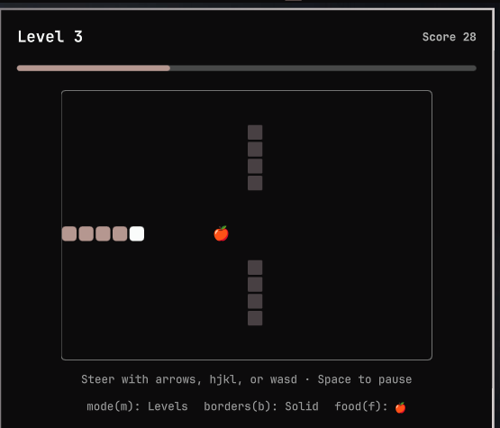
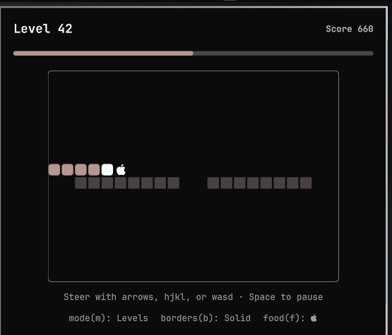

# Snake



The build's compiling. The agent's still thinking. The good idea hasn't
shown up yet. This is what you do instead of doomscrolling: a fully
playable Snake, one click away in your Omarchy top bar.

It's a self-contained `bar-widget` plugin for [Omarchy](https://omarchy.org)'s
shell, in the same style as the built-in Audio, Network, and Bluetooth
widgets: one bar icon, one popup panel.

## Install

```sh
omarchy plugin add https://github.com/jhgundersen/omarchy-snake-plugin.git --enable
```

Or, to hack on it locally, clone it straight into your plugins directory:

```sh
git clone https://github.com/jhgundersen/omarchy-snake-plugin.git ~/.config/omarchy/plugins/jhgundersen.snake
omarchy plugin enable jhgundersen.snake
```

## Uninstall

```sh
omarchy plugin remove jhgundersen.snake
```

Or disable it without removing the files:

```sh
omarchy plugin disable jhgundersen.snake
```

## Playing

Click the snake icon in the bar to open the panel. Each open starts a fresh
run.

- **Arrow keys or `hjkl`** — steer
- **Space** — pause/resume, or restart after a game over
- **`m`** — toggle between Levels and Endless mode
- **`f`** or click the board — cosmetic easter egg: cycles the food skin
- **`w`** or the ↺ button in the header — toggle solid walls (default, running
  into an edge ends the run) vs. wrapping walls (stepping off one side
  re-enters from the opposite side)
- **Esc** — close the panel

## Levels



Two modes, swap with `m`:

- **Levels** (default) — the header shows your current level and a thin
  progress bar tracks score toward the next one. You start on **Level 1**
  with an open board; each level up to 25 takes 12 points, then the cost
  itself climbs by one point per level (26 takes 13, 27 takes 14, ...) up
  to **Level 50**. From level 2 on, each level lays out a different wall
  pattern to route around — a bar with a gap, a cross, a ring, pillars,
  and a few more — cycling through 8 shapes, with the gaps getting
  narrower for the first three cycles (up to level 25) before holding at
  their tightest for the rest. Leveling up respawns the snake on a clear
  patch of the new layout (score and best carry over) and nudges the food
  to a new skin.
- **Endless** — the classic game: open board, no obstacles, no leveling,
  score just climbs.

## Files

- `manifest.json` — plugin manifest (`bar-widget` kind)
- `Panel.qml` — bar icon + popup panel + game logic, all in one entry point
- `preview.png` — marketplace listing screenshot
- `screenshot-levels.png` — levels/obstacles screenshot
- `LICENSE` — MIT

## License

MIT — see [LICENSE](LICENSE). No external dependencies beyond the Omarchy
shell APIs (`qs.Ui`, `qs.Commons`) it runs inside.
